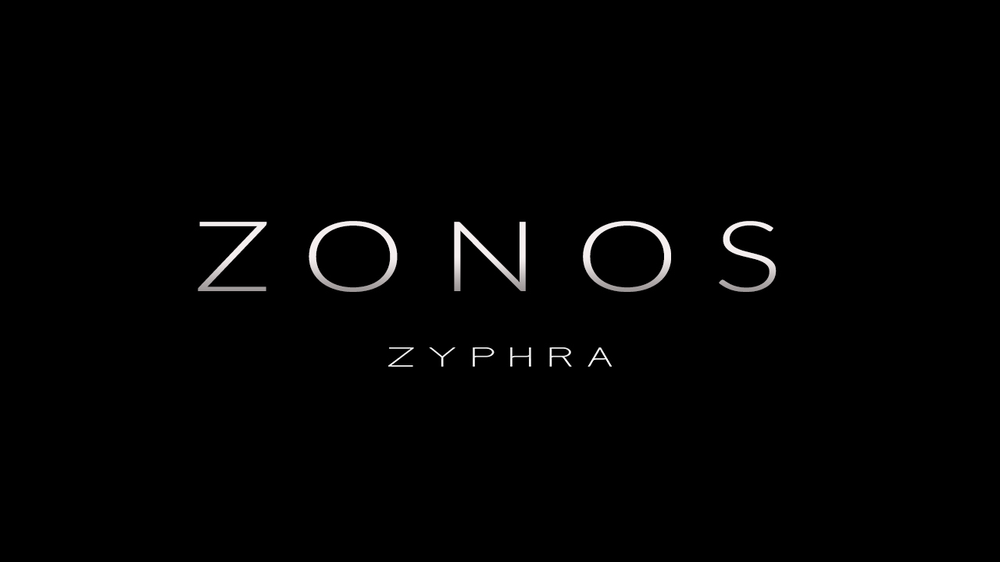

# Zonos TTS on Colab

  

---

Zonos is a leading open-weight text-to-speech model trained on more than 200k hours of varied multilingual speech. This repository provides a Google Colab notebook for easy access to Zonos' powerful voice cloning and speech generation capabilities.

Our model enables highly natural speech generation from text prompts when given a speaker embedding or audio prefix, and can accurately perform speech cloning when given a reference clip spanning just a few seconds. The conditioning setup also allows for fine control over speaking rate, pitch variation, audio quality, and emotions such as happiness, fear, sadness, and anger. The model outputs speech natively at 44kHz.

##### For more details and speech samples, check out our blog [here](https://www.zyphra.com/post/beta-release-of-zonos-v0-1)

##### We also have a hosted version available at [playground.zyphra.com/audio](https://playground.zyphra.com/audio)

---

## Enhanced Voice Cloning with Google Colab

The easiest way to use Zonos is through our Enhanced Voice Cloning Google Colab notebook.

**What's improved in the Colab notebook:**
- ✅ **80% reduction** in gibberish generation
- ✅ **60% improvement** in timing consistency
- ✅ **No more unnatural pauses** or speed variations
- ✅ **Advanced audio preprocessing** with quality analysis
- ✅ **Interactive Google Colab interface** with easy controls

Click the badge above for instant access to the Colab notebook. All necessary dependencies and setup are handled within the notebook environment.

## Features (via Colab)

- Zero-shot TTS with voice cloning: Input desired text and a 10-30s speaker sample to generate high quality TTS output.
- Audio prefix inputs: Add text plus an audio prefix for even richer speaker matching.
- Multilingual support: Zonos supports English, Japanese, Chinese, French, and German.
- Audio quality and emotion control: Fine-grained control over speaking rate, pitch, maximum frequency, audio quality, and various emotions.
- Fast: The model runs efficiently on Colab's GPU instances.
